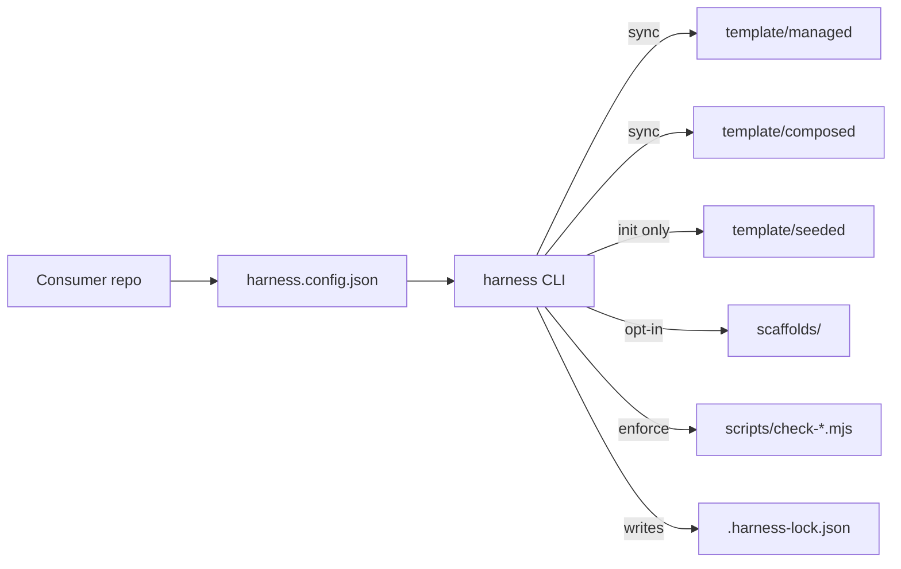

# Architecture

> **Last updated:** 2026-05-02 (CS01 stub; expanded in CS02+)

## Overview

The agent-harness is a pure-Node CLI distributed via `npx -y github:henrik-me/agent-harness#vX.Y.Z` (and optionally via npm in a future CS). It ships:

- **Process docs** in `template/{managed,composed,seeded}/` that consumer repos sync into their root.
- **Linters** in `scripts/` that enforce structured-doc shape.
- **Scaffolds** in `scaffolds/` for opt-in copy-and-customize patterns (smoke, migrations, container-validate, etc.).
- **Schemas** in `schemas/` for the config, lock file, and per-doc structures.
- **CLI** in `bin/` + libraries in `lib/`.
- **Reusable GitHub workflow** for consumers to wire up CI (CS12+).

## Components

(stubs — fleshed out as each component is built)

### CLI dispatcher (`bin/harness.mjs`, CS04)

Subcommands: `init | sync | check | lint | harvest | check-migration | composed-audit | pack | version | whoami`.

### Sync engine (`lib/sync.mjs`, `lib/composed.mjs`, `lib/templating.mjs`, `lib/lock.mjs`, CS03)

Three file classes: `managed` (overwrite), `composed` (managed core + marker-preserved local blocks), `seeded` (create-if-missing). Composed parser is fail-closed and strict per [CS03 of the cs-plan](project/clickstops/active/active_cs01_bootstrap-repo/harness-cs-plan.md).

### Doc-schema lib + linters (`lib/doc-schema.mjs`, `scripts/check-*.mjs`, CS05–CS07)

One linter per structured doc, all built on a shared primitives lib.

### Scaffolds (`scaffolds/<name>/`, CS10)

Opt-in starting points: smoke, migrations, container-validate, health-check, seed, verify-deploy, feature-flags, cs-probes.

### Reusable workflow (`.github/workflows/harness-checks.yml`, CS12)

`on: workflow_call`. Consumers call it from their CI with ~10 lines.

## Data model

The harness has no persistent data store of its own. State lives in:

- `harness.config.json` (consumer-checked-in, schema in `schemas/`)
- `.harness-lock.json` (consumer-checked-in, generated by `harness sync`)
- `LEARNINGS.md` per consumer (structured by `schemas/learning.schema.json`)

## External integrations

- GitHub (Actions, Releases, Rulesets, Apps for the WORKBOARD bot at CS15a)
- Optional npm registry (deferred to CS20)

## Cross-cutting concerns

- **Auth (consumer side):** while harness repo is private (CS01–CS15a), consumers need a fine-grained PAT or GitHub App token with `contents:read` on the harness repo; from CS15b onward, no token needed.
- **Telemetry:** the harness CLI emits no telemetry.
- **Versioning:** SemVer, with major/minor/patch policy in `template/managed/OPERATIONS.md` (CS08).

## Decision log

ADRs land in `docs/adr/` (created when first ADR is authored in CS02).

## Known constraints

- Pure ESM, Node ≥ 20.
- Zero runtime dependencies for the CLI.
- Must work on Windows + Linux + macOS for consumer repos (path handling).
