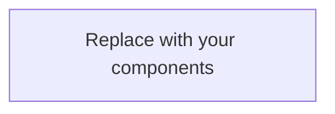

# Architecture

> **Last updated:** <!-- YYYY-MM-DD (author / CS-or-PR) -->
>
> **Purpose:** This file is created once by `harness init` and is never overwritten on subsequent syncs.
> Fill in each section; delete placeholder text as you go.

---

## Overview

<!-- Replace the paragraph and diagram below with a concise description of your system. -->

This system is <!-- one-line summary: what it is, what problem it solves -->.

Key characteristics:

- **Runtime / language:** <!-- e.g. Node 20 / TypeScript 5, Python 3.12, Go 1.22 -->
- **Deployment target:** <!-- e.g. GitHub Actions, AWS Lambda, Kubernetes -->
- **Primary consumers:** <!-- e.g. internal tooling, public API clients, partner integrations -->



---

## Components

<!-- List each major component (service, library, CLI, worker, etc.).
     For each entry describe: responsibility, key interfaces, and notable constraints.
     Example format shown below — replace with real entries. -->

- **Component A** — _Responsibility:_ does X. _Interface:_ exposes Y. _Constraints:_ Z.
- **Component B** — _Responsibility:_ does X. _Interface:_ exposes Y. _Constraints:_ Z.

### Component detail template

For significant components, expand with a subsection:

```
### <Component name> (`path/to/entrypoint`, added in <version>)

What it does, how it fits into the larger system, and any non-obvious design
choices. Link to the relevant ADR(s) when they exist.
```

---

## Data model

<!-- Describe the data entities your system owns or significantly depends on.
     Include:
       - Persistent stores (databases, queues, file system layouts)
       - Key schemas or types (link to schema files where they exist)
       - Ownership boundaries (which component reads/writes each store)

     Example skeleton below — replace or extend as needed. -->

### Stores

| Store | Type | Owner component | Notes |
|-------|------|-----------------|-------|
| <!-- e.g. `db/main.sqlite` --> | <!-- SQLite / Postgres / S3 --> | <!-- CLI / API --> | <!-- brief note --> |

### Key schemas

<!-- Link to schema definition files using paths relative to the consumer repo root.
     Do NOT use paths like `../../schemas/` — use root-relative paths instead (LRN-050).
     Example:
       - `schemas/harness.config.schema.json` — harness config
-->

- _Add links to schema files here._

### State lifecycle

<!-- Describe how state is created, mutated, and destroyed.
     e.g. "Records are created by the ingest worker, updated by the reconciler,
     and soft-deleted after 90 days by the purge job." -->

_Describe state transitions here._

---

## Decision log

<!-- Record architectural decisions here. Two approaches are supported — pick one:

  OPTION A — Link to an ADR directory:
    ADRs live in `docs/adr/` (root-relative).  Add a row per decision:

    | ADR | Date | Status | Summary |
    |-----|------|--------|---------|
    | `docs/adr/0001-example.md` | YYYY-MM-DD | Accepted | One-line summary |

  OPTION B — Inline entries (suitable when ADR volume is low):
    ### Decision: <short title>
    - **Date:** YYYY-MM-DD
    - **Status:** Proposed | Accepted | Superseded
    - **Context:** Why this decision was needed.
    - **Decision:** What was decided.
    - **Consequences:** Trade-offs and follow-up actions.

  Replace this comment block with real entries. -->

_No decisions recorded yet. Add your first ADR or inline entry above._
